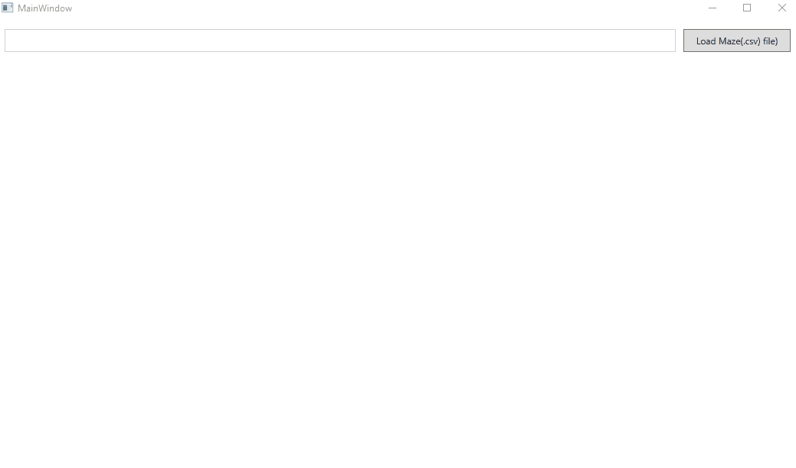

# Solve Maze Manual and Auto

# GUI functionality

- Will read a .csv file and creates a maze. 
- Maze.csv and NopathMaze.csv are added to the project.
- A gif is attached on how to use the project. All keys used are displayed in the bottom of the gif.

User Story 1
- User can Enter the Row and Column to see what is in the Cell (Wall, Empty, Etc) 
- Can see the no of walls and Empty spaces available in the Maze

User Story 2
- User can Manually solve the puzzle by checking the Manual radio button and clicking on Start. User can user right, left, up, down arrow keys to nagivate in the maze.
- All movements in the maze are recorded in the listbox. Once user reaches finish he will see a message "Maze solved"
- By selecting items using keyboad in the List box user can navigate the path how the user solved the Maze.

User Story 3
- User can Automatically solve the puzzle by checking the Auto radio button and clicking on Start. Once the maze is solved "Maze Solved" is displayed
- All movements are recorded in the listbox. 
- By selecting items using keyboard in the List box user can navigate the path how the Maze is solved automatically.

## DEMO

## Authors
- Ravi Bayyana
